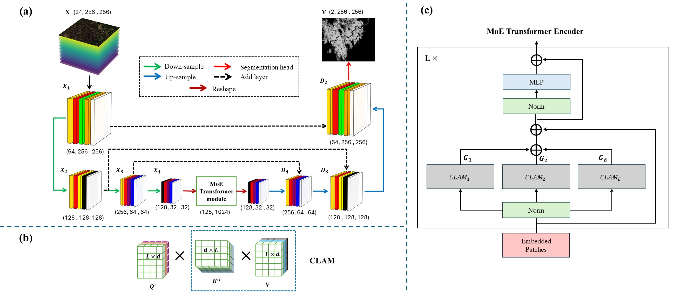
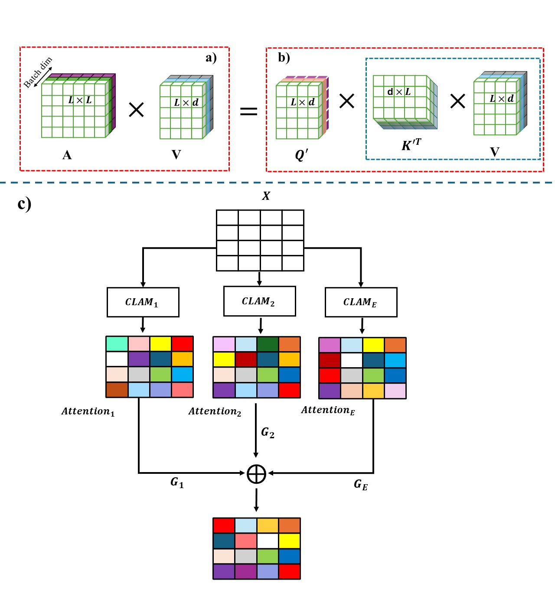
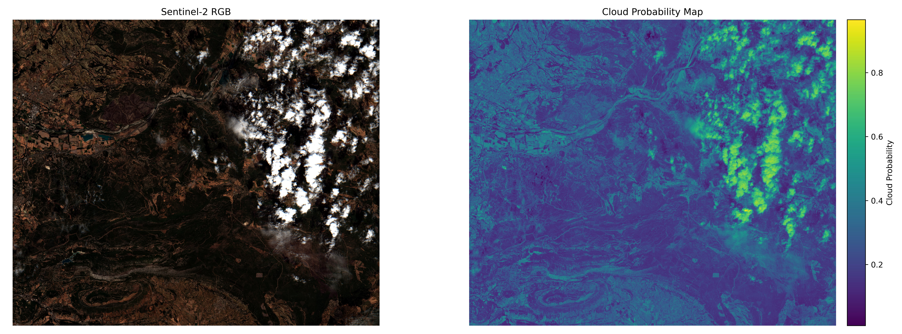

# CA-MTransUNet: Cloud-Aware Mixture-of-Experts Linear Transformer U-Net for forest burned area (FBA) mapping using Sentinel-1 and Sentinel-2 images

Sahand Tahermanesh, [Ali Jamali](https://www.researchgate.net/profile/Ali-Jamali), Armin Moghimi, Amin Mohsenifar, Ehsan Khankeshizadeh, and Ali Mohammadzadeh

Citation
---------------------

**Please kindly cite the paper if this code is useful and helpful for your research.**

      @article{Tahermanesh2026,
        title = {CA-MTransUNet: Cloud-Aware Mixture-of-Experts Linear Transformer U-Net for forest burned area (FBA) mapping using Sentinel-1 and Sentinel-2 images},
        author = {Tahermanesh, S., Jamali, A., Moghimi, A., Mohsenifar, A., Khankeshizadeh, E., & Mohammadzadeh, A. },
        journal = {Big Earth Data},
        volume = {},
        pages = {1–30},
        year = {2026},
        issn = {},
        doi = {https://doi.org/10.1016/j.jag.2023.103332},
        url = {https://www.tandfonline.com/doi/full/10.1080/20964471.2025.2598994?src=}
      }

## License

Copyright (c) 2026 Ali Jamali. Released under the MIT License. See [LICENSE](LICENSE) for details.

